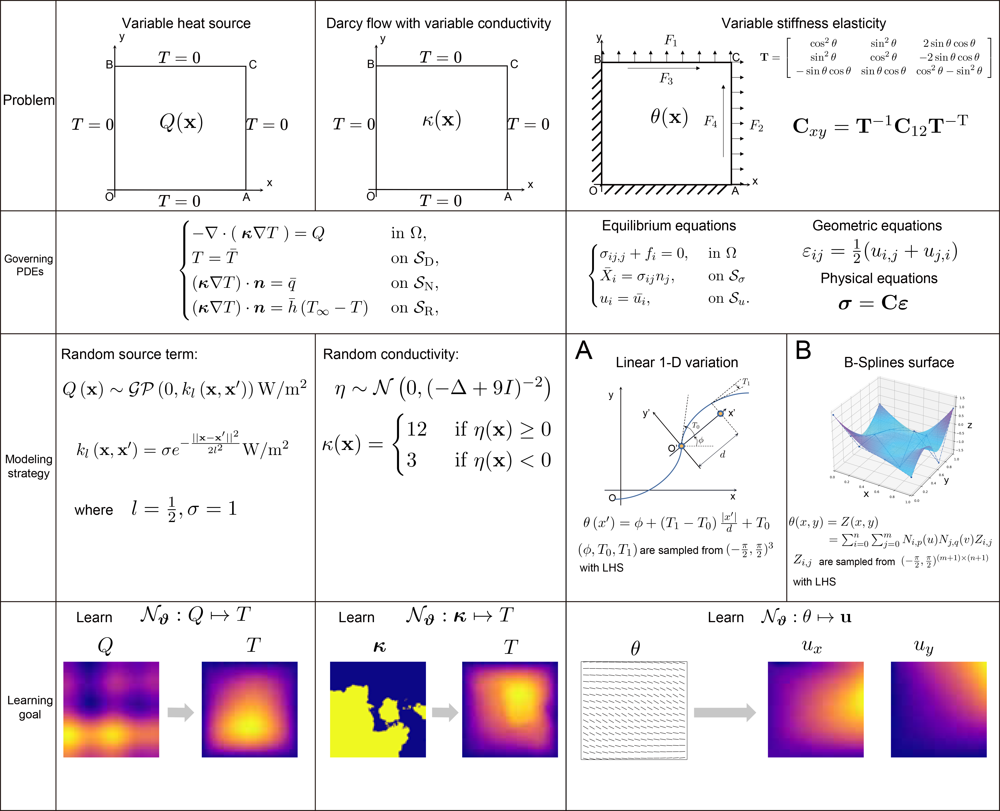

# Variational operator learning: A unified paradigm marrying training neural operators and solving partial differential equations

This repository contains the code for the paper:
- [(VOL) Variational operator learning: A unified paradigm marrying training neural operators and solving partial differential equations](https://arxiv.org/abs/2304.04234)

## HighLights


 - Backpropagation-free residual: Different from physics-informed approaches, VOL does not need to conduct any additional backpropagation operation to calculate residual.
 - Matrix-free manner (linear time complexity for residual calculation & $O(1)$ space complexity): VOL also does not need to calculate or assemble stiffness matrix like what we do in traditional FEMs pipeline.
 - For all experiments, VOL uses a label-free training set and follows a power scaling law.
 - Strictly satisfied Dirichlet boundary condition.
 - VOL can be applied to *any field-type neural operator* in principle.
## Benchmarks


## Guide to Reproduce the experiment

If you want to reproduce experiments in the paper, please follow the steps below:

 - Comment out or delete the code block under `if __name__ == '__main__':` of the corresponding scripts.
 - Paste specific settings of experiments you want to reproduce. Note you need to specify all file paths again in the code, because these file paths in my code may not exist on your computers. 
 - You need to make sure `trainid` variable matches the physics you want to simulate according to `DataSetL1` class; you need to make sure `Resolution` variable matches the resolution of the data you want to simulate; you need to make sure the trial kernel and the test kernel used in the experiment match the resolution and the physics.
 - Run the script.
 
## Settings of scaling experiments


### Heat transfer with variable heat source 
Paste the following code and run Variableheatsource.py
```python

trainnum_list = [100,200,500,1000,2000,5000,10000]
num_step_list = [2,]
lr_list=[0.01,]
withshift_list = [True,]
num_cycles_list = [0.5,]
num_epoches_list = [50,]
bs_list = [16,] # 


experiments_doing_num=1
current_exnum = 0 # 
for i in range(20230821,20230821+5):
    for tn in trainnum_list:
        for num_step in num_step_list:
            for lr in lr_list:
                for sft in withshift_list:
                    for num_cycles in num_cycles_list:
                        for bs in bs_list:
                            for num_epoches in num_epoches_list:
                                if experiments_doing_num<=current_exnum:
                                    experiments_doing_num=experiments_doing_num+1
                                    continue
                                    
                                else:
                                    print('experiment doing num: {}'.format(experiments_doing_num))
                                    batch_size = bs
                                    trainnum=tn
                                    testnum=2000
                                    num_training_steps = int(math.ceil(trainnum/batch_size)*num_epoches)
                                    learningrate=lr
                                    weight_decay=1e-3
                                    # num_cycles=0.3
                                    configlist = [
                                        {
                                        "momentum": 0,
                                        "lr": learningrate,
                                        "optimizer": "adamw",
                                        "scheduler": 'cosine_with_warm',
                                        "scheduler_config": {"warm_steps":num_training_steps//10,
                                        "num_training_steps": num_training_steps,
                                        "num_cycles":num_cycles},
                                        "multimodels":True,
                                        "num_epoches":num_epoches,
                                        "residual_loss_type_list":['gongEeTiDuWeak']*num_epoches,
                                        "batch_size": bs,
                                        "traindata": trainnum,
                                        "testdata": testnum,
                                        "trainseed": i,
                                        "regularL2":False,
                                        "test_function": True,
                                        "weight_decay": weight_decay,
                                        # "val_mode": True,
                                        "shift": sft,
                                        "num_step": num_step,
                                        "experiment_name": "ParaQPARALLELS_withgrid/bs{0}train{1}test{2}seed{3}lr{4}ep{5}warm5percentdecay{6}cycle{7}datadype{8}_numstep{9}_shift{10}_withgrid".format(bs,trainnum,testnum,i,learningrate,num_epoches,weight_decay,num_cycles,datatype,num_step,sft),
                                        "ifgrid":True
                                        } 
                                        
                                        ]
                                    print('Starting: ')
                                    print(configlist[0])
                                    trainOneParameter(config=configlist[0])
                                    experiments_doing_num=experiments_doing_num+1

```


### Darcy flow
Paste the following code and run VariableCoefficientDarcyflow.py
```python

trainnum_list = [100,200,500,1000,2000,5000,10000]
num_step_list = [2,]
lr_list=[0.01,]
withshift_list = [True,]
num_cycles_list = [0.5,]
num_epoches_list = [10,]
bs_list = [16,] 

experiments_doing_num=1
current_exnum = 0 # 
for i in range(1314,1314+5):
    for tn in trainnum_list:
        for num_step in num_step_list:
            for lr in lr_list:
                for sft in withshift_list:
                    for num_cycles in num_cycles_list:
                        for bs in bs_list:
                            for num_epoches in num_epoches_list:
                                if experiments_doing_num<=current_exnum:
                                    experiments_doing_num=experiments_doing_num+1
                                    continue
                                    
                                else:
                                    print('experiment doing num: {}'.format(experiments_doing_num))
                                    batch_size = bs
                                    trainnum=tn
                                    testnum=2000
                                    num_training_steps = int(math.ceil(trainnum/batch_size)*num_epoches)
                                    learningrate=lr
                                    weight_decay=1e-3
                                    # num_cycles=0.3
                                    configlist = [
                                        {
                                        "momentum": 0,
                                        "lr": learningrate,
                                        "optimizer": "adamw",
                                        "scheduler": 'cosine_with_warm',
                                        "scheduler_config": {"warm_steps":num_training_steps//10,
                                        "num_training_steps": num_training_steps,
                                        "num_cycles":num_cycles},
                                        "multimodels":True,
                                        "num_epoches":num_epoches,
                                        "residual_loss_type_list":['gongEeTiDuWeak']*num_epoches,
                                        "batch_size": bs,
                                        "traindata": trainnum,
                                        "testdata": testnum,
                                        "trainseed": i,
                                        "regularL2":False,
                                        "test_function": True,
                                        "weight_decay": weight_decay,
                                        # "val_mode": True,
                                        "shift": sft,
                                        "num_step": num_step,
                                        "experiment_name": "ParaDarcyWeakPARALLELS_withgrid20230816/bs{0}train{1}test{2}seed{3}lr{4}ep{5}warm5percentdecay{6}cycle{7}datadype{8}_numstep{9}_shift{10}_withgrid".format(bs,trainnum,testnum,i,learningrate,num_epoches,weight_decay,num_cycles,datatype,num_step,sft),
                                        "ifgrid":True
                                        } 
                                        ]
                                    print('Starting: ')
                                    print(configlist[0])
                                    trainOneParameter(config=configlist[0])
                                    experiments_doing_num=experiments_doing_num+1

```


### Elasticity A
Paste the following code and run VariableStiffnessElasticity.py
```python
for trainnum in [100,200,500,1000,2000,5000,10000]:
    num_epoches = 50
    batch_size=16   
    # trainnum=2000
    testnum=2000
    num_training_steps = int(math.ceil(trainnum/batch_size)*num_epoches)
    resolution = 33
    angle_dir = r'E:\xtf\32x32ss\angle100000_Linear32x32\angle100000_Linear32x32'
    results_dir = r'E:\xtf\32x32ss\angle100000_Linear32x32\linearlayer1results_32x32s_loadgaijunbu'
    num_step = [2,]
    for ns in num_step:
        configlist = [
            {
            "momentum": 0,
            "lr":1e-2,
            "optimizer": "adamw",
            "multimodels":True,
            "num_epoches":num_epoches,
            "scheduler": 'cosine_with_warm',
            "scheduler_config": {"warm_steps":num_training_steps//10,
            "num_training_steps": num_training_steps,
            "num_cycles":0.5},
            "residual_loss_type_list": ['gongEeTiDuWeak']*100,
            "batch_size": batch_size,
            "trainseed": i,
            "traindata": trainnum,
            "testdata": testnum,
            # "val_mode": True,
            "experiment_name": "linear_sizes/train{}test{}_resolution{}_seed{}_step{}".format(trainnum,testnum,resolution,i,ns),
            "num_step": ns,
            "resolution": resolution,
            "BT":r"D:\xtf\desktopcode\kernels\elasticityBT_{}.npy".format(resolution-1),
            "el": 100/(resolution-1),
            "test_function": True,
            } 
            for i in range(20230803,20230803+5)
            ]
        for j in range(len(configlist)):
            trainOneParameter(config=configlist[j])
```

### Elasticity B
Paste the following code and run VariableStiffnessElasticity.py
```python
for trainnum in [100,200,500,1000,2000,5000,10000]:
    angle_dir = r'E:\xtf\data\Elasticity\256'
    results_dir = r'E:\xtf\data\Elasticity\results_257'
    num_epoches = 50
    batch_size=16   
    # trainnum=2000
    testnum=2000
    num_training_steps = int(math.ceil(trainnum/batch_size)*num_epoches)
    resolution = 257
    num_step = 2
    configlist = [
        {
        "momentum": 0,
        "lr":1e-2,
        "optimizer": "adamw",
        "multimodels":True,
        "num_epoches":num_epoches,
        "scheduler": 'cosine_with_warm',
        "scheduler_config": {"warm_steps":num_training_steps//10,
        "num_training_steps": num_training_steps,
        "num_cycles":0.5},
        "residual_loss_type_list": ['gongEeTiDuWeak']*100,
        "batch_size": 16,
        "trainseed": i,
        "traindata": trainnum,
        "testdata": testnum,
        # "val_mode": True,
        "experiment_name": "NURBSPARALLELS_sizes/train{}test{}_resolution{}_seed{}_step2".format(trainnum,testnum,resolution,i),
        "num_step": num_step,
        "resolution": resolution,
        "BT":r"D:\xtf\desktopcode\kernels\elasticityBT_{}.npy".format(resolution-1),
        "el": 100/(resolution-1),
        "test_function": True,
        } 
        for i in range(20230823,20230823+5)
        ]
    for j in range(len(configlist)):
        trainOneParameter(config=configlist[j])
```


## Resolution experiments

Paste the following code and run VariableCoefficientDarcyflow.py
### Darcy flow

```python

for Resolution in [32,64,128,256,512]:
    if Resolution==128:
        data_resource='datablock'
    else:
        data_resource='matlab'
    el = 1/(Resolution-1)
    if trainid==2:
        angle_dir = r'E:\xtf\32x32ss\angle100000_nc32x32'
        results_dir = r'E:\xtf\32x32ss\layer1results_32x32s'
    elif trainid==3:
        angle_dir = r'E:\xtf\32x32ss\angle100000_nc32x32'
        results_dir = r'E:\xtf\32x32ss\layer1results_32x32s_loadgaijunbu'
    elif trainid==5:
        angle_dir = r'E:\xtf\Heat30x30'
        results_dir = r'E:\xtf\Heat30x30\2022-12-22-TrainData\TrainData'
    elif trainid==8:
        angle_dir = r'E:\xtf\Heat30x30\coeff30x30\GenRandData'
        # results_dir = r'E:\xtf\heatdcliucode\heatresult32'
        # results_dir = r'E:\xtf\heatdcliucode\heatresult32_20230105'
        results_dir = r'E:\xtf\heatdcliucode\heatresult30'
    elif trainid==9:
        # angle_dir = r'E:\xtf\Heat30x30\coeff30x30\GenRandData'
        angle_dir = r'E:\xtf\heatdcliucode\KL\ParaQ30x30_20230130'
        
        # results_dir = r'E:\xtf\heatdcliucode\heatresult30_paraheatsource'
        results_dir = r'E:\xtf\heatdcliucode\heatresult30_paraheatsource_20230130'

    elif trainid == 11 and data_resource=='matlab':
        angle_dir = r'E:\xtf\data\darcyflow\neuraloperator-master\data_generation\darcy\data\{}'.format(Resolution)

        results_dir = r'E:\xtf\data\darcyflow\neuraloperator-master\data_generation\darcy\data\{}_results\transpose'.format(Resolution)

    elif trainid == 11 and data_resource=='datablock':

        angle_dir = r'E:\xtf\data\darcyflow\neuraloperator-master\data_generation\darcy\data\{}\input_darcy_{}_1.npy'.format(Resolution,Resolution)

        # results_dir = r'E:\xtf\data\darcyflow\neuraloperator-master\data_generation\darcy\data\{}\result_darcy_{}_1_transposed.npy'.format(Resolution,Resolution) # 

        # results_dir = r'E:\xtf\data\darcyflow\neuraloperator-master\data_generation\darcy\data\{}\result_darcy_{}_1.npy'.format(Resolution,Resolution)

        results_dir = r'E:\xtf\data\darcyflow\neuraloperator-master\data_generation\darcy\data\{}\results_2100.npy'.format(Resolution,Resolution) # 
    # do 2000 first. 10000 would be considered at proper time.
    trainnum_list = [2000,]
    num_step_list = [2,]
    # lr_list=[0.01,]
    lr_list=[0.02,]
    withshift_list = [True,]
    num_cycles_list = [0.5,]
    num_epoches_list = [50,]
    bs_list = [16,] # 
    
    experiments_doing_num=1
    current_exnum = 0 # 

    for i in range(1314,1314+5):
        

        for tn in trainnum_list:


            for num_step in num_step_list:
                for lr in lr_list:
                    for sft in withshift_list:
                        for num_cycles in num_cycles_list:
                            for bs in bs_list:
                                for num_epoches in num_epoches_list:
                                    if experiments_doing_num<=current_exnum:
                                        experiments_doing_num=experiments_doing_num+1
                                        continue
                                        
                                    else:
                                        print('experiment doing num: {}'.format(experiments_doing_num))
                                        batch_size = bs
                                        trainnum=tn
                                        testnum=2000
                                        num_training_steps = int(math.ceil(trainnum/batch_size)*num_epoches)
                                        learningrate=lr
                                        weight_decay=1e-3
                                        # num_cycles=0.3
                                        configlist = [
                                            {
                                            "momentum": 0,
                                            "lr": learningrate,
                                            "optimizer": "adamw",
                                            "scheduler": 'cosine_with_warm',
                                            "scheduler_config": {"warm_steps":num_training_steps//10,
                                            "num_training_steps": num_training_steps,
                                            "num_cycles":num_cycles},
                                            "multimodels":True,
                                            "num_epoches":num_epoches,
                                            "residual_loss_type_list":['gongEeTiDuWeak']*num_epoches,
                                            "batch_size": bs,
                                            "traindata": trainnum,
                                            "testdata": testnum,
                                            "trainseed": i,
                                            "regularL2":False,
                                            "test_function": True,
                                            "weight_decay": weight_decay,
                                            # "val_mode": True,
                                            "shift": sft,
                                            "num_step": num_step,
                                            "experiment_name": "ParaDarcyWeakPARALLELS_resolution/bs{0}train{1}test{2}seed{3}lr{4}ep{5}warm5percentdecay{6}cycle{7}datadype{8}_numstep{9}_shift{10}_R{11}withgrid_chongxinfem".format(bs,trainnum,testnum,i,learningrate,num_epoches,weight_decay,num_cycles,datatype,num_step,sft,Resolution),
                                            "ifgrid":True,
                                            # "model": model_test
                                            } 
                                            
                                            ]
                                        print('Starting: ')
                                        print(configlist[0])
                                        trainOneParameter(config=configlist[0])
                                        experiments_doing_num=experiments_doing_num+1


```


### Elasticity B
Paste the following code and run VariableStiffnesselasticity.py
```python
for trainnum in [2000,]:
    for resolution in [33,65,129,257,513]:
        # please specify the datasets path of the related resolution here yourself, you can use the following code block
        # if resolution== 33:
            # angle_dir = 
            # results_dir = 
        # elif resolution== 65:
            # angle_dir =
            # results_dir =
        # elif resolution== 129:
            # angle_dir =
            # results_dir =
        # if resolution== 257:
            # angle_dir = 
            # results_dir = 
        # elif resolution== 513:
            # angle_dir =
            # results_dir =
     
        num_epoches = 50
        batch_size=16   
        if resolution==513:
            batch_size=8
        # trainnum=2000
        testnum=2000
        num_training_steps = int(math.ceil(trainnum/batch_size)*num_epoches)
        # resolution = 257
        num_step = 2
        configlist = [
            {
            "momentum": 0,
            "lr":1e-2,
            "optimizer": "adamw",
            "multimodels":True,
            "num_epoches":num_epoches,
            "scheduler": 'cosine_with_warm',
            "scheduler_config": {"warm_steps":num_training_steps//10,
            "num_training_steps": num_training_steps,
            "num_cycles":0.5},
            "residual_loss_type_list": ['gongEeTiDuWeak']*100,
            "batch_size": 16,
            "trainseed": i,
            "traindata": trainnum,
            "testdata": testnum,
            # "val_mode": True,
            "experiment_name": "NURBSPARALLELS_sizes/train{}test{}_resolution{}_seed{}_step2".format(trainnum,testnum,resolution,i),
            "num_step": num_step,
            "resolution": resolution,
            "BT":r"D:\xtf\desktopcode\kernels\elasticityBT_{}.npy".format(resolution-1),
            "el": 100/(resolution-1),
            "test_function": True,
            } 
            for i in range(20230823,20230823+5)
            ]
        for j in range(len(configlist)):
            trainOneParameter(config=configlist[j])
```


## Comparative experiments verifying generalization benefits

### The first experiment: Compare VOL+CG and CG on the same dataset

#### VOL+CG

Paste the following code and run  VOLCG_elasticity_step.py.

```python

Res_list=[33,129,257]
for Resolution in Res_list:
    
    # if Resolution==129:
    #     angle_dir = 
    #     results_dir = 

    # if Resolution==257:

    #     angle_dir = 
    #     results_dir = 
    
    # if Resolution==33:

    #     angle_dir = 
    #     results_dir = 


    el=100/(Resolution-1)
    trainnum=2000
    batch_size=16
    num_epoches=51
    num_training_steps = int(math.ceil(trainnum/batch_size)*num_epoches)

    for ns in [1,2,5,10,25,50,100]:
        trainid=3
        configlist = [
            {
            "momentum": 0,
            "lr":1e-2,
            "optimizer": "adamw",
            "multimodels":True,
            "num_epoches":num_epoches,
            "scheduler": 'cosine_with_warm',
            "scheduler_config": {"warm_steps":num_training_steps//10,
            "num_training_steps": num_training_steps,
            "num_cycles":0.5},
            "residual_loss_type_list": ['gongEeTiDuWeak']*100,
            "batch_size": 1,
            "trainseed": i,
            "traindata": trainnum,
            "testdata": 2000,
            # "val_mode": True,
            "experiment_name": 'Res{}ns{}'.format(Resolution, ns), # you can specify exp name yourself
            "num_step": ns,
            "resolution": Resolution,
            "BT":r"D:\xtf\desktopcode\kernels\elasticityBT_{}.npy".format(Resolution-1),
            "el": 100/(Resolution-1),
            "test_function": True,
            "record_single_loop_time": False,

            } 
            for i in range(20230730,20230730+5)
            ]
        for j in range(len(configlist)):
            trainOneParameter(config=configlist[j])

```

#### CG


Paste the following code and run CG-A.py 

```python


for resolution in [33,128,257]:


    if trainid==2:
        angle_dir = r'E:\xtf\32x32ss\angle100000_nc32x32'
        results_dir = r'E:\xtf\32x32ss\layer1results_32x32s'
    elif trainid==3:
        if resolution==33:
            angle_dir = r'E:\xtf\32x32ss\angle100000_nc32x32'
            results_dir = r'E:\xtf\32x32ss\results_32x32_iterate'
        elif resolution==129:
            angle_dir = r'E:\xtf\data\Elasticity\128\angle100000_nc128x128'
            results_dir = r'E:\xtf\data\Elasticity\results_129'

        elif resolution==513:
            angle_dir = r'E:\xtf\data\Elasticity\512'
            results_dir = r'E:\xtf\data\Elasticity\results_513'

        elif resolution==257:
            angle_dir = r'E:\xtf\data\Elasticity\256'
            results_dir = r'E:\xtf\data\Elasticity\results_257'

    elif trainid==6:
        angle_dir = r'E:\xtf\32x32ss\angle100000_Linear32x32\angle100000_Linear32x32'
        # results_dir = r'H:\my_codeworkspace\bishe_new\data\layer1results_32x32s_loadgaijunbu'
        results_dir = r'E:\xtf\32x32ss\angle100000_Linear32x32\linearlayer1results_32x32s_loadgaijunbu'
    
    residual_loss_type='gongEeTiDuWeak'

    configl = [{
        "momentum": 0,
        "lr": 1,
        "optimizer": "sgd",
        "multimodels":True,
        "num_epoches":51,
        "batch_size": 1,
        "optimizer_step": step,
        "resolution": resolution,
        "BT":r"D:\xtf\desktopcode\kernels\elasticityBT_{}.npy".format(resolution-1),
        "el": 100/(resolution-1),
        # "save_dir": save_dir,
        "test_function": True,
        "shift": False
    } for step in [1,2,5,10,25,50,100]]


    for j in range(7):
        run(config=configl[j])

```


Paste the following code and run CG-R.py 

```python

import math
Res_list=[33,129,257]
for resolution in Res_list:
    
    if resolution==33:
        angle_dir = r'E:\xtf\32x32ss\angle100000_nc32x32'
        results_dir = r'E:\xtf\32x32ss\results_32x32_iterate'
    elif resolution==129:
        angle_dir = r'E:\xtf\data\Elasticity\128\angle100000_nc128x128'
        results_dir = r'E:\xtf\data\Elasticity\results_129'

    elif resolution==513:
        angle_dir = r'E:\xtf\data\Elasticity\512'
        results_dir = r'E:\xtf\data\Elasticity\results_513'

    elif resolution==257:
        angle_dir = r'E:\xtf\data\Elasticity\256'
        results_dir = r'E:\xtf\data\Elasticity\results_257'


    el=100/(resolution-1)
    trainnum=2000
    batch_size=16
    num_epoches=51
    num_training_steps = int(math.ceil(trainnum/batch_size)*num_epoches)

    for ns in [1,2,5,10,25,50,100]:
        trainid=3
        # experiment_name=
        configlist = [
            {
            "momentum": 0,
            "lr":1,
            "optimizer": "sgd",
            "multimodels":True,
            "num_epoches":num_epoches,
            "scheduler": 'cosine_with_warm',
            "scheduler_config": {"warm_steps":num_training_steps//10,
            "num_training_steps": num_training_steps,
            "num_cycles":0.5},
            "residual_loss_type_list": ['gongEeTiDuWeak']*100,
            "batch_size": 1,
            "trainseed": i,
            "traindata": trainnum,
            "testdata": 2000,
            # "val_mode": True,
            "experiment_name": 'RECORDTIMETMP',
            "optimizer_step": ns,
            "resolution": resolution,
            "BT":r"D:\xtf\desktopcode\kernels\elasticityBT_{}.npy".format(resolution-1),
            "el": 100/(resolution-1),
            "test_function": True,
            "record_single_loop_time": True,

            } 
            for i in range(20230730,20230730+1)
            ]
        for j in range(len(configlist)):

            tmean,tstd = run_get_time(config=configlist[j])
            print(r'Resolution {} with num step {}: time is {:.2f}$\pm${:.2f}'.format(configlist[j].get('resolution'),ns,tmean*1000,tstd*1000))

```

### The second experiment: Compare VOL+CG and CG on the test dataset.


#### VOL+CG
Paste the following code and run VariableStiffnesselasticity.py.
```python
for resolution in [33,129,257]:

    # if resolution==129:
    #     angle_dir = 
    #     results_dir = 

    # if resolution==257:

    #     angle_dir = 
    #     results_dir = 
    
    # if resolution==33:

    #     angle_dir = 
    #     results_dir = 
    num_epoches = 50
    batch_size=16   
    trainnum=2000
    testnum=2000
    num_training_steps = int(math.ceil(trainnum/batch_size)*num_epoches)
    
    num_step = [1,5,10,25,50,100]
    for ns in num_step:
        configlist = [
            {
            "momentum": 0,
            "lr":1e-2,
            "optimizer": "adamw",
            "multimodels":True,
            "num_epoches":num_epoches,
            "scheduler": 'cosine_with_warm',
            "scheduler_config": {"warm_steps":num_training_steps//10,
            "num_training_steps": num_training_steps,
            "num_cycles":0.5},
            "residual_loss_type_list": ['gongEeTiDuWeak']*100,
            "batch_size": batch_size,
            "trainseed": i,
            "traindata": trainnum,
            "testdata": testnum,
            # "val_mode": True,
            "experiment_name": "NURBSPARALLELS_steps/train{}test{}_resolution{}_seed{}_step{}".format(trainnum,testnum,resolution,i,ns),
            "num_step": ns,
            "resolution": resolution,
            "BT":r"D:\xtf\desktopcode\kernels\elasticityBT_{}.npy".format(resolution-1),
            "el": 100/(resolution-1),
            "test_function": True,
            } 
            for i in range(20230803,20230803+5)
            ]
        for j in range(len(configlist)):
            print('Starting:')
            print(configlist[j])
            trainOneParameter(config=configlist[j])

```

## Comparative experiments on different optimization strategies

Paste the following code and run optimstrategy_comparisonex.py

```python
'''
exps at 512 resolution strategy exps
'''

Resolution = 512
el = 1/(Resolution-1)
if trainid==2:
    angle_dir = r'E:\xtf\32x32ss\angle100000_nc32x32'
    results_dir = r'E:\xtf\32x32ss\layer1results_32x32s'
elif trainid==3:
    angle_dir = r'E:\xtf\32x32ss\angle100000_nc32x32'
    results_dir = r'E:\xtf\32x32ss\layer1results_32x32s_loadgaijunbu'
elif trainid==5:
    angle_dir = r'E:\xtf\Heat30x30'
    results_dir = r'E:\xtf\Heat30x30\2022-12-22-TrainData\TrainData'
elif trainid==8:
    angle_dir = r'E:\xtf\Heat30x30\coeff30x30\GenRandData'
    # results_dir = r'E:\xtf\heatdcliucode\heatresult32'
    # results_dir = r'E:\xtf\heatdcliucode\heatresult32_20230105'
    results_dir = r'E:\xtf\heatdcliucode\heatresult30'
elif trainid==9:
    # angle_dir = r'E:\xtf\Heat30x30\coeff30x30\GenRandData'
    angle_dir = r'E:\xtf\heatdcliucode\KL\ParaQ30x30_20230130'
    
    # results_dir = r'E:\xtf\heatdcliucode\heatresult30_paraheatsource'
    results_dir = r'E:\xtf\heatdcliucode\heatresult30_paraheatsource_20230130'

elif trainid == 11 and data_resource=='matlab':
    angle_dir = r'E:\xtf\data\darcyflow\neuraloperator-master\data_generation\darcy\data\{}'.format(Resolution)

    results_dir = r'E:\xtf\data\darcyflow\neuraloperator-master\data_generation\darcy\data\{}_results\transpose'.format(Resolution)

elif trainid == 11 and data_resource=='datablock':
    angle_dir = r'E:\xtf\data\darcyflow\neuraloperator-master\data_generation\darcy\data\{}\input_darcy_{}_1.npy'.format(Resolution,Resolution)

    results_dir = r'E:\xtf\data\darcyflow\neuraloperator-master\data_generation\darcy\data\{}\result_darcy_{}_1.npy'.format(Resolution,Resolution)


# for exstrategy in ['minimize energy']:
trainnum_list = [2000,]
num_step_list = [2,]
withshift_list = [True,]
num_cycles_list = [0.5,]
bs_list = [16,] 
# exstrategy = 'minimize energy'
# exstrategy = 'direct minimize residual norm'
# exstrategy = 'purely data-driven'


'''
20230829
darcy521_voltest.txt and darcy512_2000_diagcg.txt
'''
exstrategy = 'VOL'
strcun = {'direct minimize residual norm': 'dmcn',
            'purely data-driven':'pdd',
            'VOL':'VOL'}


# '''
# do not use wrong kernel, or results are never good.
# '''


lr_list=[0.02,]
num_epoches_list=[50,]
num_step_list=[2,500]

for exstrategy in ['purely data-driven','VOL','direct minimize residual norm']:

    for residual_loss_type_list in [['gongEeTiDuWeak']*num_epoches,]:
        if exstrategy=='purely data-driven':
            residual_loss_type_list=[' ']*num_epoches
            num_step_list=[2,]
        elif exstrategy=='direct minimize residual norm':
            num_step_list=[2,]
        else:    
            num_step_list=[2,500]
        
        for i in range(1314,1314+5):

            experiments_doing_num=1
            current_exnum = 0 # 

            for tn in trainnum_list:
                for num_step in num_step_list:
                    for lr in lr_list:
                        for sft in withshift_list:
                            for num_cycles in num_cycles_list:
                                for bs in bs_list:
                                    for num_epoches in num_epoches_list:
                                        if experiments_doing_num<=current_exnum:
                                            experiments_doing_num=experiments_doing_num+1
                                            continue
                                            
                                        else:
                                            print('experiment doing num: {}'.format(experiments_doing_num))
                                            batch_size = bs
                                            trainnum=tn
                                            testnum=2000
                                            num_training_steps = int(math.ceil(trainnum/batch_size)*num_epoches)
                                            learningrate=lr
                                            weight_decay=1e-3
                                            # num_cycles=0.3
                                            configlist = [
                                                {
                                                "momentum": 0,
                                                "lr": learningrate,
                                                "optimizer": "adamw",
                                                "scheduler": 'cosine_with_warm',
                                                "scheduler_config": {"warm_steps":num_training_steps//10,
                                                "num_training_steps": num_training_steps,
                                                "num_cycles":num_cycles},
                                                "multimodels":True,
                                                "num_epoches":num_epoches,
                                                "residual_loss_type_list":residual_loss_type_list,
                                                "batch_size": bs,
                                                "traindata": trainnum,
                                                "testdata": testnum,
                                                "trainseed": i,
                                                "regularL2":False,
                                                "test_function": True,
                                                "weight_decay": weight_decay,
                                                # "val_mode": True,
                                                "shift": sft,
                                                "num_step": num_step,
                                                # "experiment_name": "ParaDarcyWeakPARALLELS_strategy_test/bs{0}train{1}test{2}seed{3}lr{4}ep{5}warm5percentdecay{6}cycle{7}{8}_numstep{9}_shift{10}_resolution_{11}withgrid_{12}".format(bs,trainnum,testnum,i,learningrate,num_epoches,weight_decay,num_cycles,datatype,num_step,sft,Resolution,strcun[exstrategy]),
                                                # "experiment_name": "ParaDarcyWeakPARALLELS_strategy/bs{0}train{1}test{2}seed{3}lr{4}ep{5}warm5percentdecay{6}cycle{7}{8}_numstep{9}_shift{10}_resolution_{11}withgrid_{12}".format(bs,trainnum,testnum,i,learningrate,num_epoches,weight_decay,num_cycles,datatype,num_step,sft,Resolution,strcun[exstrategy]),
                                                # "experiment_name": "ParaDarcyWeakPARALLELS_strategy/ns100/{13}/bs{0}train{1}test{2}seed{3}lr{4}ep{5}warm5percentdecay{6}cycle{7}{8}_numstep{9}_shift{10}_resolution_{11}withgrid_{12}".format(bs,trainnum,testnum,i,learningrate,num_epoches,weight_decay,num_cycles,datatype,num_step,sft,Resolution,strcun[exstrategy],residual_loss_type_list[0]),
                                                "experiment_name": "ParaDarcyWeakPARALLELS_strategy/ep50/{12}/bs{0}train{1}test{2}seed{3}lr{4}ep{5}warm5percentdecay{6}cycle{7}{8}_numstep{9}_shift{10}_resolution_{11}withgrid_{12}".format(bs,trainnum,testnum,i,learningrate,num_epoches,weight_decay,num_cycles,datatype,num_step,sft,Resolution,strcun[exstrategy],residual_loss_type_list[0]),
                                                "ifgrid":True,
                                                "strategy":exstrategy,
                                                # "model": model_test
                                                } 
                                                
                                                ]
                                            print('Starting: ')
                                            print(configlist[0])
                                            trainOneParameter(config=configlist[0])
                                            experiments_doing_num=experiments_doing_num+1

```

## Comparative experiments between VOL and PINOs

### VOL
Paste the following code and run VOL_PINO_comparisonex.py
```python
        '''
        VOL on darcy fem datasets
        '''
        lr_list=[0.02,]
        num_epoches_list=[100,]
        num_step_list=[2,]

        for exstrategy in ['VOL',]:

            for residual_loss_type_list in [['gongEeTiDuWeak']*num_epoches,]:
                
                for i in range(1314,1314+5):

                    # model_path = r"E:\xtf\data\results\ParaDarcyWeakPARALLELS_withgrid20230826_strategy\bs16train2000test2000seed{}lr0.01ep10warm5percentdecay0.001cycle0.5float32_numstep2_shiftTrue_resolution_512withgrid_dmcn\model physics informed epoch is10.pth".format(i)   
                    
                    # model_path = r"E:\xtf\data\results\ParaDarcyWeakPARALLELS_withgrid20230826_strategy\bs16train2000test2000seed{}lr0.01ep10warm5percentdecay0.001cycle0.5datadypefloat32_numstep2_shiftTrue_resolution_512withgrid_datadriven\model physics informed epoch is10.pth".format(i)   
                    
                    # model_path = r"E:\xtf\data\results\ParaDarcyWeakPARALLELS_withgrid20230816\bs16train2000test2000seed{}lr0.01ep10warm5percentdecay0.001cycle0.5datadypefloat32_numstep2_shiftTrue_resolution_512withgrid\model physics informed epoch is10.pth".format(i)
                    
                    # model_test.load_state_dict(torch.load(model_path))


                    experiments_doing_num=1
                    current_exnum = 0 # 

                    for tn in trainnum_list:
                        for num_step in num_step_list:
                            for lr in lr_list:
                                for sft in withshift_list:
                                    for num_cycles in num_cycles_list:
                                        for bs in bs_list:
                                            if Resolution==512:
                                                bs = 8
                                            for num_epoches in num_epoches_list:
                                                if experiments_doing_num<=current_exnum:
                                                    experiments_doing_num=experiments_doing_num+1
                                                    continue
                                                    
                                                else:
                                                    print('experiment doing num: {}'.format(experiments_doing_num))
                                                    batch_size = bs
                                                    trainnum=tn
                                                    testnum=2000
                                                    num_training_steps = int(math.ceil(trainnum/batch_size)*num_epoches)
                                                    learningrate=lr
                                                    weight_decay=1e-3
                                                    # num_cycles=0.3
                                                    configlist = [
                                                        {
                                                        "momentum": 0,
                                                        "lr": learningrate,
                                                        "optimizer": "adamw",
                                                        "scheduler": 'cosine_with_warm',
                                                        "scheduler_config": {"warm_steps":num_training_steps//10,
                                                        "num_training_steps": num_training_steps,
                                                        "num_cycles":num_cycles},
                                                        "multimodels":True,
                                                        "num_epoches":num_epoches,
                                                        "residual_loss_type_list":residual_loss_type_list,
                                                        "batch_size": bs,
                                                        "traindata": trainnum,
                                                        "testdata": testnum,
                                                        "trainseed": i,
                                                        "regularL2":False,
                                                        "test_function": True,
                                                        "weight_decay": weight_decay,
                                                        # "val_mode": True,
                                                        "shift": sft,
                                                        "num_step": num_step,
                                                        "experiment_name": "ParaDarcyINTERP_comparison/ep50/{12}/bs{0}train{1}test{2}seed{3}lr{4}ep{5}warm5percentdecay{6}cycle{7}{8}_numstep{9}_shift{10}_resolution_{11}withgrid_{12}".format(bs,trainnum,testnum,i,learningrate,num_epoches,weight_decay,num_cycles,datatype,num_step,sft,Resolution,strcun[exstrategy],residual_loss_type_list[0]),
                                                        "ifgrid":True,
                                                        "strategy":exstrategy,
                                                        # "model": model_test
                                                        } 
                                                        
                                                        ]
                                                    print('Starting: ')
                                                    print(configlist[0])
                                                    trainOneParameter(config=configlist[0])
                                                    experiments_doing_num=experiments_doing_num+1


        # '''
        # VOL on darcy fdm datasets
        # '''


        lr_list=[0.02,]
        num_epoches_list=[100,]
        num_step_list=[2,]

        model_test = FNO2dEnsemble(modes1=14, modes2=14, width=ensemblewidth, tisheng_dim=tisheng_dim, input_dim=1, output_dim=1,ifnodeangle=True,ensemble_num=1,implicit_learning=implicit_learning,alignment_mode=alignment_mode,ifuserpadding=ifuserpadding,padding=8,externalmodelclass=externalmodelclass,ifgrid=True)
        angle_dir = [r'E:\xtf\data\deeponet-fno-main\data\darcy_rectangular_pwc\piececonst_r421_N1024_smooth1.mat',
        r'E:\xtf\data\deeponet-fno-main\data\darcy_rectangular_pwc\piececonst_r421_N1024_smooth2.mat']
        results_dir = angle_dir
        data_resource='datablock'
        for exstrategy in ['VOL',]:

            for residual_loss_type_list in [['gongEeTiDuWeak']*num_epoches,]:
                
                for i in range(1314,1314+5):


                    experiments_doing_num=1
                    current_exnum = 0 # 

                    for tn in trainnum_list:
                        for num_step in num_step_list:
                            for lr in lr_list:
                                for sft in withshift_list:
                                    for num_cycles in num_cycles_list:
                                        for bs in bs_list:
                                            if Resolution==512:
                                                bs = 8
                                            for num_epoches in num_epoches_list:
                                                if experiments_doing_num<=current_exnum:
                                                    experiments_doing_num=experiments_doing_num+1
                                                    continue
                                                    
                                                else:
                                                    print('experiment doing num: {}'.format(experiments_doing_num))
     
                                                    
                                                    batch_size = bs
                                                    trainnum=tn
                                                    testnum=2048
                                                    num_training_steps = int(math.ceil(trainnum/batch_size)*num_epoches)
                                                    learningrate=lr
                                                    weight_decay=1e-3
                                                    # num_cycles=0.3


                                                    configlist = [
                                                        {
                                                        "momentum": 0,
                                                        "lr": learningrate,
                                                        "optimizer": "adamw",
                                                        "scheduler": 'cosine_with_warm',
                                                        "scheduler_config": {"warm_steps":num_training_steps//10,
                                                        "num_training_steps": num_training_steps,
                                                        "num_cycles":num_cycles},
                                                        "multimodels":True,
                                                        "num_epoches":num_epoches,
                                                        "residual_loss_type_list":residual_loss_type_list,
                                                        "batch_size": bs,
                                                        "traindata": trainnum,
                                                        "testdata": testnum,
                                                        "trainseed": i,
                                                        "regularL2":False,
                                                        "test_function": True,
                                                        "weight_decay": weight_decay,
                                                        "val_mode": True,
                                                        "shift": sft,
                                                        "num_step": num_step,
                                                        "experiment_name": "ParaDarcyINTERP_comparison/tmptest/{12}/bs{0}train{1}test{2}seed{3}lr{4}ep{5}warm5percentdecay{6}cycle{7}{8}_numstep{9}_shift{10}_resolution_{11}withgrid_{12}".format(bs,trainnum,testnum,i,learningrate,num_epoches,weight_decay,num_cycles,datatype,num_step,sft,Resolution,strcun[exstrategy],residual_loss_type_list[0]),
                                                        "ifgrid":True,
                                                        "strategy":exstrategy,
                                                        "model": model_test,
                                                        "testshift":0,
                                                        "parentres": 421,
                                                        } 
                                                        
                                                        ]
                                                    print('Starting: ')
                                                    print(configlist[0])

                                                    model_path = r"E:\xtf\data\results\ParaDarcyINTERP_comparison\ep50\VOL\bs{0}train{1}test2000seed{3}lr{4}ep{5}warm5percentdecay{6}cycle{7}{8}_numstep{9}_shift{10}_resolution_{11}withgrid_{12}\model physics informed epoch is100.pth".format(bs,trainnum,testnum,i,learningrate,num_epoches,weight_decay,num_cycles,datatype,num_step,sft,Resolution,strcun[exstrategy],residual_loss_type_list[0])   
                                                        
                                                    model_test.load_state_dict(torch.load(model_path))                                                    
                                               


                                                    trainOneParameter(config=configlist[0])
                                                    experiments_doing_num=experiments_doing_num+1
```
### PINO
Pretrain PINO I and test on FEM datasets

 - unzip pino_for_comparison
 - paste the following code and run python trainonmydata_testonFEM.py --config_path configs/finetune/Darcy_fromstratch.yaml
```python    
    config_file = 'configs/finetune/Darcy_fromstratch.yaml'
    with open(config_file, 'r', encoding='utf-8') as stream:
        config = yaml.load(stream, yaml.FullLoader)
    print(config_file)    
    exnum=1
    jumpflag=False
    import time
    time_interval_list=[]
    for res in [32,64,128,256]:
        
        config['data']['nx'] = res
        mean_err_list=[]

        
        for i in range(1314,1314+5):
            if exnum<=-1:
                print('done res{} and seed{} and continue'.format(res,i))
                # print(exnum)
                exnum+=1
                jumpflag=True
                continue
            else:
                jumpflag=False
            time1 = time.time()
            print(f'Start solving seeds {i}') 
            config['seed'] = i   
            if os.path.exists('checkpoints/darcy-FDM/Res{}Seed{}.pth'.format(res,config['seed'])):     
                print('model exists, load model and just test')
                
                model = FNO2d(modes1=config['model']['modes1'],
                  modes2=config['model']['modes2'],
                  fc_dim=config['model']['fc_dim'],
                  layers=config['model']['layers'],
                  act=config['model']['act']).to(device)

                mean_err, std_err, mean_f_err, std_f_err = testopt(model, config)
                mean_err_list.append(mean_err)                
                
            else:
                print('model not exists, start from stratch.')
                model = train(args, config)
                mean_err, std_err, mean_f_err, std_f_err = test(model, config)
                mean_err_list.append(mean_err)
            time2 = time.time()
            time_interval_list.append(time2-time1)
            print('time interval :',time2-time1)
        temp_array = np.array(time_interval_list[-5:])
        print('{} time mean and std:{:.2f}$\pm${:.2f}'.format(res,temp_array.mean(),temp_array.std(ddof=1)))
```

Test PINO I on FDM datasets

 - paste the following code into trainonmydata_testonFDM.py
 - run python trainonmydata_testonFDM.py

```python
# test on FDM without test-time-opt
for res in [32,64,128,256]:

    config['data']['nx'] = res
    mean_err_list=[]
    for i in range(1314,1314+5):
        print(f'Start solving seeds {i}') 
        config['seed'] = i   
        if os.path.exists('checkpoints/darcy-FDM/Res{}Seed{}.pth'.format(res,config['seed'])):     
            print('model exists, load model and just test')
            
            model = FNO2d(modes1=config['model']['modes1'],
                modes2=config['model']['modes2'],
                fc_dim=config['model']['fc_dim'],
                layers=config['model']['layers'],
                act=config['model']['act']).to(device)
            model.load_state_dict(torch.load('checkpoints/darcy-FDM/Res{}Seed{}.pth'.format(res,config['seed'])))
            mean_err, std_err, mean_f_err, std_f_err = test(model, config)
            mean_err_list.append(mean_err)                
            
            # print('model not exists, start from stratch.')
            # model = train(args, config)
            # mean_err, std_err, mean_f_err, std_f_err = test(model, config)
            # mean_err_list.append(mean_err)
    # get the std and mean of different seeds
    mean_err_list = np.array(mean_err_list)
    mean_err_all = np.mean(mean_err_list)
    std_err_all = np.std(mean_err_list, ddof = 1)

    print(f'Res: {res} mean_err: {mean_err_all}, std_err: {std_err_all}')
```

Test-time-optimization PINO II on FEM datasets
 - paste the following code into trainonmydata_testonFEM.py
 - run python trainonmydata_testonFEM.py --config_path configs/finetune/DarcytestonFEM.yaml

```python
# test on FEM without test-time-opt
# This is test-time-optimization 100 on [32,64,128,256]
exnum=1
jumpflag=False
import time
for res in [32,64,128,256]:
    
    config['data']['nx'] = res
    mean_err_list=[]
    time_interval_list=[]
    
    for i in range(1314,1314+5):
        if exnum<=8:
            print('done res{} and seed{} and continue'.format(res,i))
            # print(exnum)
            exnum+=1
            jumpflag=True
            continue
        else:
            jumpflag=False
        time1 = time.time()
        print(f'Start solving seeds {i}') 
        config['seed'] = i   
        if os.path.exists('checkpoints/darcy-FDM/Res{}Seed{}.pth'.format(res,config['seed'])):     
            print('model exists, load model and just test')
            
            model = FNO2d(modes1=config['model']['modes1'],
                modes2=config['model']['modes2'],
                fc_dim=config['model']['fc_dim'],
                layers=config['model']['layers'],
                act=config['model']['act']).to(device)

            mean_err, std_err, mean_f_err, std_f_err = testopt(model, config)
            mean_err_list.append(mean_err)                
            
        else:
            print('model not exists, start from stratch.')
            model = train(args, config)
            mean_err, std_err, mean_f_err, std_f_err = test(model, config)
            mean_err_list.append(mean_err)
        time2 = time.time()
        time_interval_list.append(time2-time1)
        print('time interval: ',time2-time1)
        print('mean error: ',mean_err)
        print('mean f error', mean_f_err)
        exnum+=1
    if jumpflag==True:
        continue
    # get the std and mean of different seeds
    mean_err_list = np.array(mean_err_list)
    mean_err_all = np.mean(mean_err_list)
    std_err_all = np.std(mean_err_list, ddof = 1)

    mean_time_interval_all = np.mean(time_interval_list)
    std_time_interval_all = np.std(time_interval_list, ddof = 1)
    # print elements of time_interval_list in a line
    print(f'Res: {res} {time_interval_list[0]} {time_interval_list[1]} {time_interval_list[2]} {time_interval_list[3]} {time_interval_list[4]} ')
    print(f'Res: {res} mean time_interval: {mean_time_interval_all} std_time_interval: {std_time_interval_all}')
    # print elements of mean_err_list in a line
    print(f'Res: {res} {mean_err_list[0]} {mean_err_list[1]} {mean_err_list[2]} {mean_err_list[3]} {mean_err_list[4]} ')
    print(f'Res: {res} mean_err: {mean_err_all*100:.2f}, std_err: {std_err_all*100:.2f}')

```
Test-time-optimization PINO II on FDM datasets
 - paste the following code into trainonmydata_testonFDM.py
```python
    # This is test-time-optimization 100 on [32,64,128,256]
    import time
    for res in [32,64,128,256]:

        config['data']['nx'] = res
        mean_err_list=[]
        time_interval_list=[]
        
        for i in range(1314,1314+5):
            time1 = time.time()
            print(f'Start solving seeds {i}') 
            config['seed'] = i   
            if os.path.exists('checkpoints/darcy-FDM/Res{}Seed{}.pth'.format(res,config['seed'])):     
                print('model exists, load model and just test')
                
                model = FNO2d(modes1=config['model']['modes1'],
                  modes2=config['model']['modes2'],
                  fc_dim=config['model']['fc_dim'],
                  layers=config['model']['layers'],
                  act=config['model']['act']).to(device)

                mean_err, std_err, mean_f_err, std_f_err = testopt(model, config)
                mean_err_list.append(mean_err)                
                
            else:
                print('model not exists, start from stratch.')
                model = train(args, config)
                mean_err, std_err, mean_f_err, std_f_err = test(model, config)
                mean_err_list.append(mean_err)
            time2 = time.time()
            time_interval_list.append(time2-time1)
            print('time interval: ',time2-time1)
            print('mean error: ',mean_err)
            print('mean f error', mean_f_err)

        # get the std and mean of different seeds
        mean_err_list = np.array(mean_err_list)
        mean_err_all = np.mean(mean_err_list)
        std_err_all = np.std(mean_err_list, ddof = 1)

        mean_time_interval_all = np.mean(time_interval_list)
        std_time_interval_all = np.std(time_interval_list, ddof = 1)
        # print elements of time_interval_list in a line
        print(f'Res: {res} {time_interval_list[0]} {time_interval_list[1]} {time_interval_list[2]} {time_interval_list[3]} {time_interval_list[4]} ')
        print(f'Res: {res} mean time_interval: {mean_time_interval_all} std_time_interval: {std_time_interval_all}')
        # print elements of mean_err_list in a line
        print(f'Res: {res} {mean_err_list[0]} {mean_err_list[1]} {mean_err_list[2]} {mean_err_list[3]} {mean_err_list[4]} ')
        print(f'Res: {res} mean_err: {mean_err_all}, std_err: {std_err_all}')
```
 - run python trainonmydata_testonFDM.py --config_path configs/finetune/DarcytestonFDM.yaml


Test-time-optimization PINO III on FEM datasets

 - paste the following code into trainonmydata_testonFEM.py
```python
    
exnum=1
jumpflag=False
import time
for res in [32,64,128,256]:
    
    config['data']['nx'] = res
    mean_err_list=[]
    time_interval_list=[]
    
    for i in range(1314,1314+5):
        if exnum<=-1:
            print('done res{} and seed{} and continue'.format(res,i))
            # print(exnum)
            exnum+=1
            jumpflag=True
            continue
        else:
            jumpflag=False
        time1 = time.time()
        print(f'Start solving seeds {i}') 
        config['seed'] = i   
        if os.path.exists('checkpoints/darcy-FDM/Res{}Seed{}.pth'.format(res,config['seed'])):     
            print('model exists, load model and just test')
            
            model = FNO2d(modes1=config['model']['modes1'],
                modes2=config['model']['modes2'],
                fc_dim=config['model']['fc_dim'],
                layers=config['model']['layers'],
                act=config['model']['act']).to(device)

            mean_err, std_err, mean_f_err, std_f_err = testopt(model, config)
            mean_err_list.append(mean_err)                
            
        else:
            print('model not exists, start from stratch.')
            model = train(args, config)
            mean_err, std_err, mean_f_err, std_f_err = test(model, config)
            mean_err_list.append(mean_err)
        time2 = time.time()
        time_interval_list.append(time2-time1)
        print('time interval: ',time2-time1)
        print('mean error: ',mean_err)
        print('mean f error', mean_f_err)
        exnum+=1
    if jumpflag==True:
        continue
    # get the std and mean of different seeds
    mean_err_list = np.array(mean_err_list)
    mean_err_all = np.mean(mean_err_list)
    std_err_all = np.std(mean_err_list, ddof = 1)

    mean_time_interval_all = np.mean(time_interval_list)
    std_time_interval_all = np.std(time_interval_list, ddof = 1)
    # print elements of time_interval_list in a line
    print(f'Res: {res} {time_interval_list[0]} {time_interval_list[1]} {time_interval_list[2]} {time_interval_list[3]} {time_interval_list[4]} ')
    print(f'Res: {res} mean time_interval: {mean_time_interval_all} std_time_interval: {std_time_interval_all}')
    # print elements of mean_err_list in a line
    print(f'Res: {res} {mean_err_list[0]} {mean_err_list[1]} {mean_err_list[2]} {mean_err_list[3]} {mean_err_list[4]} ')
    print(f'Res: {res} mean_err: {mean_err_all*100:.2f}, std_err: {std_err_all*100:.2f}')

```

 - run python trainonmydata_testonFEM.py --config_path configs/finetune/DarcytestonFEM500.yaml

Test-time-optimization PINO III on FDM datasets

 - paste the following code into trainonmydata_testonFDM.py
```python
    # This is test-time-optimization 500 on [32,64,128,256]
    import time
    for res in [32,64,128,256]:

        config['data']['nx'] = res
        mean_err_list=[]
        time_interval_list=[]
        
        for i in range(1314,1314+5):
            time1 = time.time()
            print(f'Start solving seeds {i}') 
            config['seed'] = i   
            if os.path.exists('checkpoints/darcy-FDM/Res{}Seed{}.pth'.format(res,config['seed'])):     
                print('model exists, load model and just test')
                
                model = FNO2d(modes1=config['model']['modes1'],
                  modes2=config['model']['modes2'],
                  fc_dim=config['model']['fc_dim'],
                  layers=config['model']['layers'],
                  act=config['model']['act']).to(device)

                mean_err, std_err, mean_f_err, std_f_err = testopt(model, config)
                mean_err_list.append(mean_err)                
                
            else:
                print('model not exists, start from stratch.')
                model = train(args, config)
                mean_err, std_err, mean_f_err, std_f_err = test(model, config)
                mean_err_list.append(mean_err)
            time2 = time.time()
            time_interval_list.append(time2-time1)
            print('time interval: ',time2-time1)
            print('mean error: ',mean_err)
            print('mean f error', mean_f_err)

        # get the std and mean of different seeds
        mean_err_list = np.array(mean_err_list)
        mean_err_all = np.mean(mean_err_list)
        std_err_all = np.std(mean_err_list, ddof = 1)

        mean_time_interval_all = np.mean(time_interval_list)
        std_time_interval_all = np.std(time_interval_list, ddof = 1)
        # print elements of time_interval_list in a line
        print(f'Res: {res} {time_interval_list[0]} {time_interval_list[1]} {time_interval_list[2]} {time_interval_list[3]} {time_interval_list[4]} ')
        print(f'Res: {res} mean time_interval: {mean_time_interval_all} std_time_interval: {std_time_interval_all}')
        # print elements of mean_err_list in a line
        print(f'Res: {res} {mean_err_list[0]} {mean_err_list[1]} {mean_err_list[2]} {mean_err_list[3]} {mean_err_list[4]} ')
        print(f'Res: {res} mean_err: {mean_err_all}, std_err: {std_err_all}')
```
 - run python trainonmydata_testonFDM.py --config_path configs/finetune/DarcytestonFDM500.yaml


## Datasets

### Variable heat source datasets

#### resolution 256x256

The set of files, ranging from `VH256_.part01.rar` to `VH256_.part13.rar`, comprises a heat source file named `Coeff256_log.npy` and a solution file titled `answer256_log.npy`. `Coeff256_log.npy` contains 12100 discrete heat source parameter fields, while `answer256_log.npy` contains 2100 discrete solution fields that corresponds the first 2100 fields in `Coeff256_log.npy`.

### Darcy flow datasets generated in this work via FEMs

#### resolution 32x32

`darcyfem32.rar`, comprises a coefficient folder named `32` and a solution folder titled `transpose`. The folder `32` contains 5000 files in the `.npy` format representing 5000 discrete coefficient fields, while the folder `transpose` contains 2100 files in the `.npy` format representing 2100 discrete solution fields that corresponds the first 2100 fields in folder `32`.

#### resolution 64x64

`darcyfem64.rar`, comprises a coefficient folder named `64` and a solution folder titled `transpose`. The folder `64` contains 5000 files in the `.npy` format representing 5000 discrete coefficient fields, while the folder `transpose` contains 2100 files in the `.npy` format representing 2100 discrete solution fields that corresponds the first 2100 fields in folder `64`.

#### resolution 128x128

`darcyfem128.rar`, comprises a coefficient file named `input_darcy_128_1.npy` and a solution folder titled `results_2100.npy`. The file `input_darcy_128_1.npy` contains over 4000 discrete coefficient fields, while the file `results_2100.npy` contains 2100 discrete solution fields that corresponds the first 2100 fields in `input_darcy_128_1.npy`.

#### resolution 256x256

`darcyfem256.rar`, comprises a coefficient folder named `256` and a solution folder titled `transpose`. The folder `256` contains 5000 files in the `.npy` format representing 5000 discrete coefficient fields, while the folder `transpose` contains 2100 files in the `.npy` format representing 2100 discrete solution fields that corresponds the first 2100 fields in folder `256`.

#### resolution 512x512

`darcyfem512.rar`, comprises a coefficient folder named `512` and a solution folder titled `transpose`. The folder `512` contains 5000 files in the `.npy` format representing 5000 discrete coefficient fields, while the folder `transpose` contains 2100 files in the `.npy` format representing 2100 discrete solution fields that corresponds the first 2100 fields in folder `512`.

### Darcy flow datasets generated via FDMs

#### resolution 421

Please refer the [PINO repository](https://github.com/neuraloperator/physics_informed) for two files:  `piececonst_r421_N1024_smooth1.mat` and `piececonst_r421_N1024_smooth2.mat`. They contain 2048 paramter-solution pairs in total, and are used in the test set for comparison between VOL and PINOs.


### Elasticity datasets


### Elasticity A

#### resolution 33x33

`ElasticityA.rar` comprises an angle folder named `33` and a solution folder titled `linearlayer1results_32x32s_loadgaijunbu`. The folder `angle100000_Linear32x32` contains 100000 files in the `.txt` format representing 100000 discrete angle fields (In fact, only a small portion of them are used.), while the folder `linearlayer1results_32x32s_loadgaijunbu` contains 2200 discrete displacement fields in the `.npy` format that corresponds the first 2200 angle fields in folder `angle100000_Linear32x32`.

### Elasticity B

#### resolution 33x33

`EB33.rar` comprises a folder named `32` and a solution folder titled `results33`. The folder `32` contains 5000 files in the `.txt` format representing 5000 discrete angle fields, while the folder `results33` contains 2100 discrete displacement fields in the `.npy` format that corresponds the first 2100 angle fields in folder `32`.

#### resolution 65x65

`EB65.rar` comprises a folder named `64` and a solution folder titled `results65`. The folder `64` contains 5000 files in the `.txt` format representing 5000 discrete angle fields, while the folder `results65` contains 2100 discrete displacement fields in the `.npy` format that corresponds the first 2100 angle fields in folder `64`.

#### resolution 129x129

`EB129.rar` comprises a folder named `128` and a solution folder titled `results129`. The folder `128` contains 5000 files in the `.txt` format representing 5000 discrete angle fields, while the folder `results129` contains 2100 discrete displacement fields in the `.npy` format that corresponds the first 2100 angle fields in folder `128`.

#### resolution 257x257

`EB257.rar` comprises a folder named `256` and a solution folder titled `results257`. The folder `256` contains 5000 files in the `.txt` format representing 5000 discrete angle fields, while the folder `results257` contains 2100 discrete displacement fields in the `.npy` format that corresponds the first 2100 angle fields in folder `256`.

#### resolution 513x513

`EB513_.part01.rar`, ..., `EB513_.part18.rar` comprise a folder named `512` and a solution folder titled `results513`. The folder `512` contains 5000 files in the `.txt` format representing 5000 discrete angle fields, while the folder `results513` contains 2100 discrete displacement fields in the `.npy` format that corresponds the first 2100 angle fields in folder `512`.


## My goal

In the long term, I want to design **parallel, real-time, low-carbon, reliable, explainable, robust, data-efficient neural solvers** for the next generation simulation and CAE software. 


## Citations

```
@misc{xu2023variational,
      title={Variational operator learning: A unified paradigm marrying training neural operators and solving partial differential equations}, 
      author={Tengfei Xu and Dachuan Liu and Peng Hao and Bo Wang},
      year={2023},
      eprint={2304.04234},
      archivePrefix={arXiv},
      primaryClass={cs.LG}
}
```

## License

All data and codes in this repository are distributed under CC BY-NC-SA 4.0, and related algorithms are patent-protected. If you want to use materials in this repository for commercial purposes, please contact us.

## Acknowledgements

The implementation of VOL is benefited greatly from by remarkable projects from the community. We would like to sincerely thank [FNO](https://github.com/neuraloperator/neuraloperator/tree/master), [PINO](), [F-FNO](https://github.com/alasdairtran/fourierflow), and [PyTorch](https://github.com/pytorch/pytorch) for their awesome open source.